Expense Expert is a **desktop app for keeping track of your expenses, and managing your budget, optimized for use via a Command Line Interface** (CLI) enhanced with a light-weight Graphical User Interface (GUI). If you can type fast, Expense Expert can get your expense management done faster than traditional GUI apps.

## Table of Contents

- [Quick Start](#quick-start)
- [Breakdown of the UI](#breakdown-of-the-ui)
- [Features](#features)
  - [Commands](#commands)
    - [Viewing help: ](#viewing-help--help) `help`
    - [Adding an expense: ](#adding-an-expense--add) `add`
    - [Deleting an expense: ](#deleting-an-expense--delete) `delete`
    - [Editing an expense: ](#editing-an-expense--edit) `edit`
    - [Listing all expenses: ](#listing-all-expenses--list) `list`
    - [Filtering expense(s): ](#filtering-expenses-filter) `filter`
    - [Finding expense(s): ](#finding-expenses-find) `find`
    - [Setting a monthly budget: ](#setting-a-monthly-budget-budget) `budget`
    - [Adding an Expense Category: ](#adding-an-expense-category-addcat) `addCat`
    - [Listing all Expense Categories: ](#listing-all-expense-categories-listcat) `listCat`
    - [Adding a person who owes you money: ](#adding-a-person-who-owes-you-money-person) `person`
    - [Removing a person who has paid the owed money: ](#removing-a-person-who-has-paid-the-owed-money-paid) `paid`
    - [Updating the amount a person owes you: ](#updating-the-amount-a-person-owes-you-update) `update`
    - [Clearing the program data: ](#clearing-the-program-data--clear) `clear`
    - [Exiting the program: ](#exiting-the-program--exit) `exit`
  - [Storage](#storage)
    - [Saving the data](#saving-the-data)
    - [Editing the data file](#editing-the-data-file)
- [FAQ](#faq)
- [Command summary](#command-summary)

---

## Quick start

1. Ensure you have Java `11` or above installed in your Computer.

2. Download the latest `expenseexpert.jar` from [here](https://github.com/AY2122S2-CS2103T-W09-3/tp/releases).

3. Copy the file to the folder you want to use as the _home folder_ for your Expense Expert.

4. Double-click the file to start the app. The GUI similar to the below should appear in a few seconds. 
5. The data is just for demonstration purposes. When you launch ExpenseExpert for the first time, it is not preloaded with any data. 
   

6. Type the command in the command box and press Enter to execute it. e.g. typing **`help`** and pressing Enter will open the help window. 
   Some example commands you can try:

   - **`list`** : Lists all the expenses you have recorded.

   - **`add`** `d/Lunch at VivoCity a/12.95 c/Food t/2022-03-12` : Adds a new expense of a/12.95 for Lunch at Vivocity to your list of expenses

   - **`delete`** `3` : Deletes the 3rd expense shown in the current list.

   - **`exit`** : Exits the app for you.

7. Refer to the [Features](#features) below for details of each command.

---

## Breakdown of the UI

1. **Menu Bar** : Facilitate quick access to the help window. Quiting of the application can also be done through the file drop-down option.
2. **Command Box**: Allows the user to input commands.
3. **Budget Display Box**: Displays the remaining budget.
4. **Result Box**: Displays the results of the command that the user parsed.
5. **Expense List**: List of expenses (can be all the expenses or filtered list if command had been passed).
6. **Person List**: List of people who owe the user the said sum of money.

---

## Features

**information_source: Notes about the command format:** 

- Words in `UPPER_CASE` are the parameters to be supplied by the user. 
  e.g. in `d/DESCRIPTION`, `DESCRIPTION` is a parameter which can be used as `d/Dinner at ECP`.

- Items in square brackets are optional. 
  e.g `d/DESCRIPTION [c/CATEGORY]` can be used as `d/Dinner at ECP c/Food` or as `d/Dinner at ECP`.

- Items in brackets means at least one of the components must be present.  
- e.g. `(ft/DATE) (c/CATEGORY)` can be used as `ft/2022-03`, `ft/2022-03 c/Transport` or `c/Transport`.

- Parameters can be in any order. 
  e.g. if the command specifies `d/DESCRIPTION a/AMOUNT`, `a/AMOUNT d/DESCRIPTION` is also acceptable.

- If a parameter is expected only once in the command but is instead specified multiple times, only the last occurrence of the parameter will be taken. 
  e.g. if you specify `a/12.99 a/13.50`, only `a/13.50` will be taken.

- Extraneous parameters for commands that do not take in parameters (such as `help`, `list` and `exit`) will be ignored. 
  e.g. if the command specifies `help 123`, it will be interpreted as `help`.

## Commands
### Viewing help : `help`

Shows a help window explaining how to use each command, with an added link to the user guide. 
It can also show the usage of a particular command.

Format: `help [COMMAND_NAME]`

### Adding an expense : `add`

Adds an expense to the list. Description and expense category provided must be in alphanumerical format, amount can only be positive number up to 2 decimal places
and expense date must be in yyyy-MM-dd format. Description must be unique and different from all other expenses in Expense Expert. Expense category must be from a list of user-defined categories. If Expense category is undefined, it will default to the `General` Expense Category.

Format: `add d/DESCRIPTION a/AMOUNT [c/EXPENSE_CATEGORY] t/EXPENSE_DATE`

**Examples:**

- `add d/Dinner at Astons a/35 c/Food t/2022-03-22`
- `add d/Groceries t/2022-03-23 a/50`

_This is the result of executing the command(s) above:_

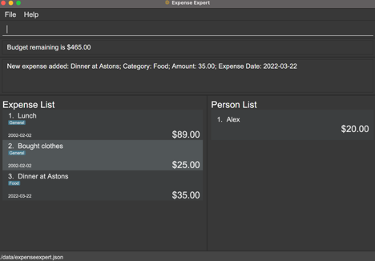

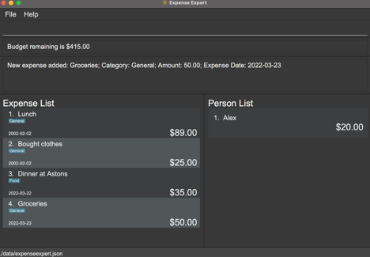

### Deleting an expense : `delete`

Deletes the expense specified by the index from the list. Run `list` before executing the command to identify the index of the expense.

Format: `delete INDEX`

Examples:

- `delete 1`

_This is the result of executing the command(s) above:_

### Editing an expense : `edit`

Edits an existing expense in the list. You need to specify the index of the expense from the list and only the syntax of the fields you want to change together
with the value you want to change to. You can specify one or more fields. Run `list` before executing the command to identify the index of the expense.

Format: `edit INDEX (d/DESCRIPTION) (a/AMOUNT) (c/EXPENSE_CATEGORY) (t/EXPENSE_DATE)`

Examples:

- `edit 1 a/40`
- `edit 2 d/Groceries from Fairprice a/80`

_This is the result of executing the command(s) above:_

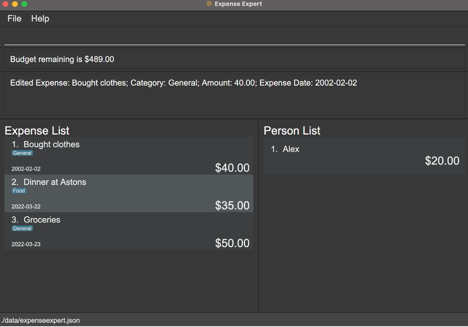

### Listing all expenses : `list`

Shows a list of all expenses recorded in Expense Expert.

Format: `list`

_This is the result of executing the command(s) above:_

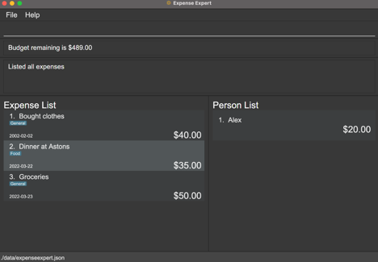

### Filtering expense(s): `filter`

Filters the expenses with the date or category provided. At least one of the fields in brackets need to be present.
Date format must be provided in yyyy-MM-dd format or in yyyy-MM format. If date provided is in yyyy-MM format,
the displayed will include all the results of that month.

Format: `filter (ft/DATE) (c/CATEGORY)`

Examples:

- `filter ft/2022-03-12`
- `filter ft/2022-03`
- `filter c/Transport`
- `filter ft/2022-03 c/Transport`

The expense list before executing the `filter` command looked as follows:

_Result of executing`filter ft/2022-03` is shown below:_

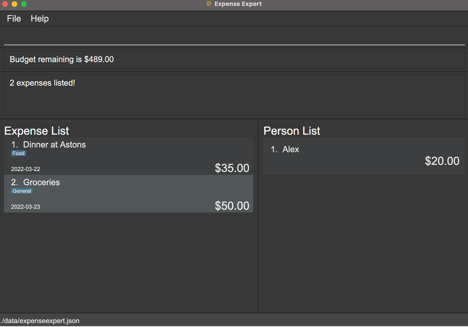

**Disclaimer** : result may vary depending upon the existing data in ExpenseExpert.

### Finding expense(s): `find`

Finds expense(s) with the stated keyword(s) in descriptors. If more than one keyword is provided, returns list of expenses with expense description that matches any of the keywords provided.

Format: `find KEYWORD [MORE_KEYWORDS]`

Examples:

- `find Cafe`
- `find Cafe Grab`

The expense list before executing the `find` command looked as follows:
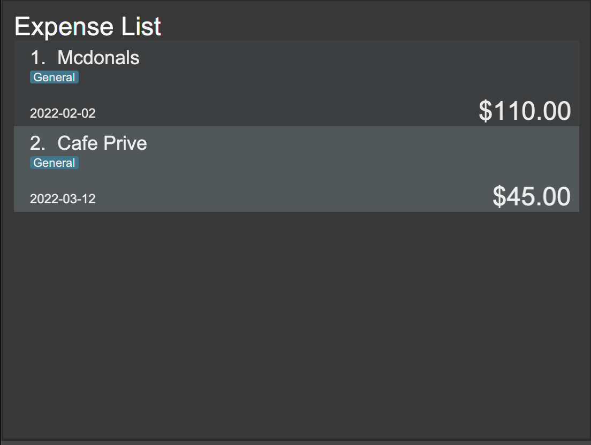

_Result of executing `find Cafe` is shown below:_

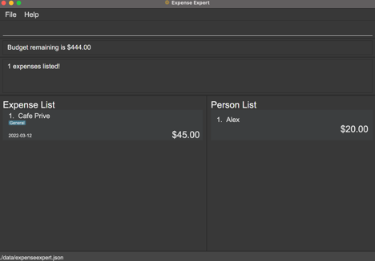

**Disclaimer** : result may vary depending upon the existing data in ExpenseExpert.

### Setting a monthly Budget: `budget`

Sets a budget for the month.

_The `add`, `delete` and `edit` command affect the monthly budget to reflect the user's remaining budget.
However, due to an incomplete implementation of the budget, transaction for every month are reflected in the current month's budget.
This is going to be rectified in the future iterations._

Format: `budget a/AMOUNT`

Examples:

- `budget a/500`

_This is the result of executing the command(s) above:_

### Adding an Expense Category: `addCat`

Adds a user-defined expense category which can be used to categorise expenses.

Format: `addCat c/EXPENSE_CATEGORY`

Examples:

- `addCat c/transport`

_This is the result of executing the command(s) above:_

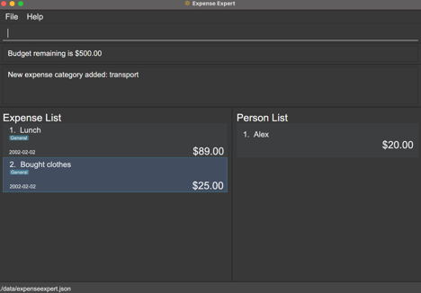

### Listing all Expense Categories: `listCat`

Shows a list of all expense categories recorded in Expense Expert.

Format: `listCat`

_This is the result of executing the command(s) above:_

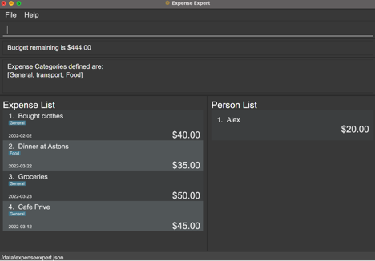

---

**The Following three commands facilitate the feature of managing the list of persons who owe you money.**

_This sections of commands does not make a difference to the budget set by the user, since the budget is only
meant to keep track of the expenses, and the amount of money lent out does not have any role to play in it._

### Adding a person who owes you money: `person`

Adds a person with the name who owes you the specific amount.

Format: `person n/PERSON_NAME a/PERSON_AMOUNT`

Examples:

- `person n/Alex a/100`

_This is the result of executing the command(s) above:_

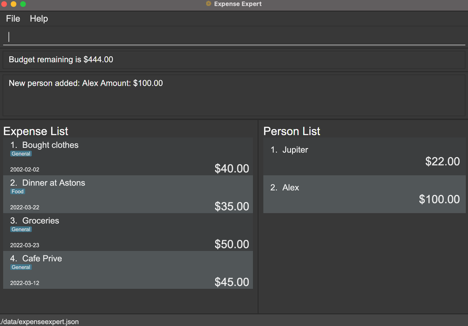

### Removing a person who has paid the owed money: `paid`

Removes a person at the index who has paid all the money they have owed.

Format: `paid INDEX`

Examples:

- `paid 1`

_This is the result of executing the command(s) above:_

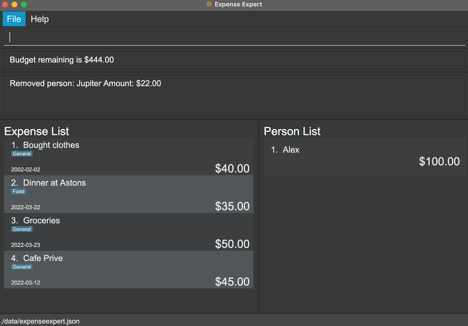

### Updating the amount a person owes you: `update`

Updates the amount owed by a person at the index in the list to the amount parsed.

Format: `update INDEX a/AMOUNT`

Examples:

- `update 4 a/1000`

_This is the result of executing the command(s) above:_

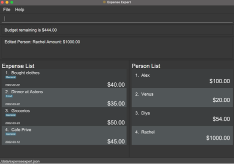

---

### Clearing the program data : `clear`

Deletes all data from Expense Expert.

Format: `clear`

_This is the result of executing the command(s) above:_

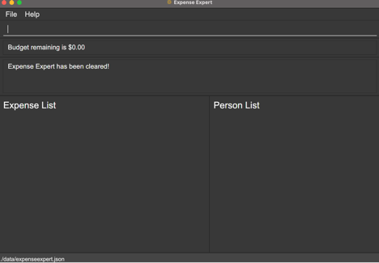

### Exiting the program : `exit`

Exits the program.

Format: `exit`

## Storage
### Saving the data

Expense Expert data are saved in the hard disk automatically after any command that changes the data. There is no need to save manually.

### Editing the data file

Expense Expert data are saved as a JSON file `[JAR file location]/data/expenseexpert.json`. Advanced users are welcome to update data directly by editing that data file.

:exclamation: **Caution:**
If your changes to the data file makes its format invalid, Expense Expert will discard all data and start with an empty data file at the next run.

---

## FAQ

**Q**: How can I transfer my data to another Computer? 
**A**: Install the app in the other computer and overwrite the empty data file it creates with the file that contains the data of your previous Expense Expert home folder.

**Q**: Can I archive the data files? 
**A**: At the moment, the application doesn't support archiving. It will be available in v2.0.

---

## Command summary

| Action                                        | Format, Examples                                                                                                                          |
|-----------------------------------------------| ----------------------------------------------------------------------------------------------------------------------------------------- |
| **Getting help**                              | `help`                                                                                                                                    |
| **Adding an expense**                         | `add d/DESCRIPTION a/AMOUNT [c/EXPENSE_CATEGORY] t/EXPENSE_DATE `   Example: `add d/Lunch at VivoCity a/12.95 c/Food t/2022-03-20`     |
| **Deleting an expense**                       | `delete INDEX`  Example: `delete 3`                                                                                                    |
| **Editing an expense**                        | `edit INDEX (d/DESCRIPTION) (a/AMOUNT) (c/EXPENSE_CATEGORY) (t/EXPENSE_DATE)`  Example: `edit 2 d/Lunch at Harbourfront Centre a/6.50` |
| **Listing all expenses**                      | `list`                                                                                                                                    |
| **Filtering expense(s)**                      | `filter (ft/FILTER_DATE) (c/CATEGORY)`   Example: `filter ft/2022-03 c/Transport`                                                      |
| **Finding expense(s)**                        | `find KEYWORD [MORE_KEYWORDS]`   Example: `find Cafe Grab Basketball`                                                                  |
| **Setting a monthly budget**                  | `budget a/AMOUNT`   Example: `budget a/1000`                                                                                           |
| **Adding an expense category**                | `addCat c/EXPENSE_CATEGORY`   Example: `addCat c/transport`                                                                            |
| **Listing all expense category**              | `listCat`                                                                                                                                 |
| **Adding a person who owes you money**        | `person n/PERSON_NAME a/PERSON_AMOUNT`   Example: `person n/Alex a/50`                                                                 |
| **Removing a person who paid the owed money** | `paid INDEX`   Example: `paid 1`                                                                                                   |
| **Updating the amount a person owes you**     | `update INDEX a/AMOUNT`  Example: `update 4 a/200`                                                                                    |
| **Clearing the program data**                 | `clear`                                                                                                                               |
| **Exiting the program**                       | `exit`                                                                                                                                    |
