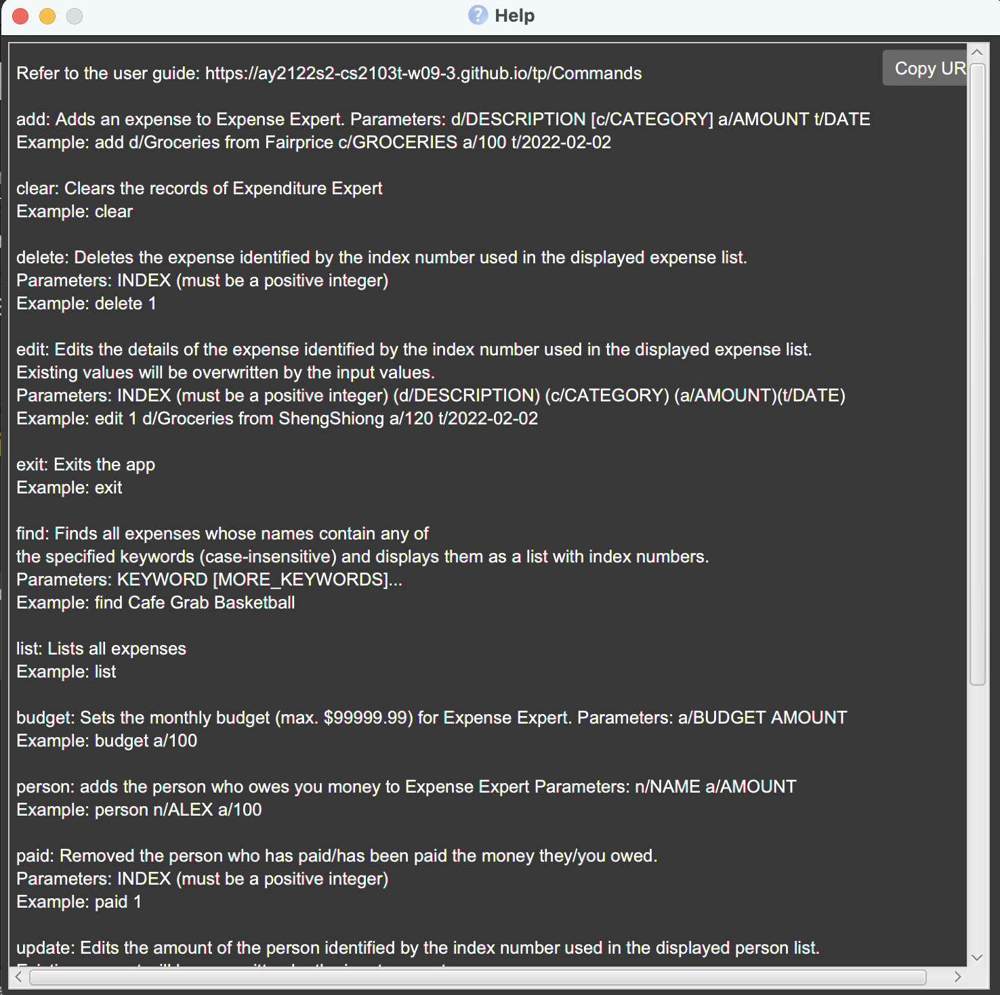

Expense Expert is a **desktop app for keeping track of your expenses, and managing your budget, optimized for use via a Command Line Interface** (CLI) while still having the benefits of a Graphical User Interface (GUI). If you can type fast, Expense Expert can get your expense management done faster than traditional GUI apps.

- Table of Contents
  {:toc}

---
## Quick start

1. Ensure you have Java `11` or above installed in your Computer.

1. Download the latest `ExpenseExpert.jar` from [here](https://github.com/AY2122S2-CS2103T-W09-3/tp/releases).

1. Copy the file to the folder you want to use as the _home folder_ for your Expense Expert.

1. Double-click the file to start the app. The GUI similar to the below should appear in a few seconds. Note how the app contains some sample data. 
   

1. Type the command in the command box and press Enter to execute it. e.g. typing **`help`** and pressing Enter will open the help window. 
   Some example commands you can try:

   - **`list`** : Lists all the expenses you have recorded.

   - **`add`** `d/Lunch at VivoCity a/12.95 c/Food t/2022-03-12` : Adds a new expense of a/12.95 for Lunch at Vivocity to your list of expenses

   - **`delete`** `3` : Deletes the 3rd expense shown in the current list.

   - **`exit`** : Exits the app for you.

1. Refer to the [Features](#features) below for details of each command.

---

## Features

**:information_source: Notes about the command format:** 

- Words in `UPPER_CASE` are the parameters to be supplied by the user. 
  e.g. in `d/DESCRIPTION`, `DESCRIPTION` is a parameter which can be used as `d/Dinner at ECP`.

- Items in square brackets are optional. 
  e.g `d/DESCRIPTION [c/CATEGORY]` can be used as `d/Dinner at ECP c/Food` or as `d/Dinner at ECP`.

- Parameters can be in any order. 
  e.g. if the command specifies `d/DESCRIPTION a/AMOUNT`, `a/AMOUNT d/DESCRIPTION` is also acceptable.

- If a parameter is expected only once in the command but is instead specified multiple times, only the last occurrence of the parameter will be taken. 
  e.g. if you specify `a/12.99 a/13.50`, only `a/13.50` will be taken.

- Extraneous parameters for commands that do not take in parameters (such as `help`, `list` and `exit`) will be ignored. 
  e.g. if the command specifies `help 123`, it will be interpreted as `help`.

### Viewing help : `help`

Shows a message explaining how to access the help page.

Format: `help`

### Adding an expense : `add`

Adds an expense to the list. Description and expense category provided must be in alphanumerical format, amount can only be positive number up to 2 decimal places
and expense date must be in yyyy-MM-dd format.

Format: `add d/DESCRIPTION a/AMOUNT c/EXPENSE_CATEGORY t/EXPENSE_DATE`

Examples:

- `add d/Dinner at Privé a/35 c/Extra expense t/2022-03-22`
- `add d/Groceries a/50 c/Essentials t/2022-03-23`

### Deleting an expense : `delete`

Deletes the expense specified by the index from the list. Run `list` before executing the command to identify the index of the expense.

Format: `delete INDEX`

Examples:

- `delete 1`

### Editing an expense : `edit`

Edits an existing expense in the list. You need to specify the index of the expense from the list and only the syntax of the fields you want to change together
with the value you want to change to. You can specify one or more fields. Run `list` before executing the command to identify the index of the expense.

Format: `edit INDEX [d/DESCIPTION] [a/AMOUNT] [c/EXPENSE_CATEGORY] [t/EXPENSE_DATE]`

Examples:

- `edit 1 a/40`
- `edit 2 d/Groceries from Fairprice a/80`

### Listing all expenses : `list`

Shows a list of all expenses recorded in Expense Expert.

Format: `list`

### Filtering expenses: `filter`

Filter expenses with the date provided. Date format must be provided in yyyy-MM-dd format or in yyyy-MM format.

Format: `filter ft/DATE`

Examples:

- `filter 2022-03-12`
- `filter 2022-03`

### Finding expenses: `find`

Find expenses with the stated keyword(s) in descriptors. If more than one keyword is provided, return list of expenses with expense description that matches any of the keywords provided.

Format: `find KEYWORD(S)`

Examples:

- `find Cafe`
- `find Cafe Grab`

### Finding expenses: `budget`

Set a budget for the month.

Format: `budget b/BUDGET`

Examples:

- `budget b/500`

### Exiting the program : `clear`

Deletes all expenses from Expense Expert.

Format: `clear`

### Exiting the program : `exit`

Exits the program.

Format: `exit`

### Saving the data

Expense Expert data are saved in the hard disk automatically after any command that changes the data. There is no need to save manually.

### Editing the data file

Expense Expert data are saved as a JSON file `[JAR file location]/data/ExpenseExpert.json`. Advanced users are welcome to update data directly by editing that data file.

:exclamation: **Caution:**
If your changes to the data file makes its format invalid, Expense Expert will discard all data and start with an empty data file at the next run.

### Archiving data files `[coming in v2.0]`

_Details coming soon ..._

---

## FAQ

**Q**: How can I transfer my data to another Computer? 
**A**: Install the app in the other computer and overwrite the empty data file it creates with the file that contains the data of your previous Expense Expert home folder.

---

## Command summary

| Action     | Format, Examples                                                                                                                      |
| ---------- |---------------------------------------------------------------------------------------------------------------------------------------|
| **Help**   | `help`                                                                                                                                | |
| **Add**    | `add d/DESCRIPTION a/AMOUNT [c/EXPENSE_CATEGORY] t/EXPENSE_DATE `   Example: `add d/Lunch at VivoCity a/12.95 c/Food t/2022-03-20`    |
| **Delete** | `delete INDEX`  Example: `delete 3`                                                                                                   |
| **Edit**   | `edit INDEX [d/DESCRIPTION] [a/AMOUNT] [c/EXPENSE_CATEGORY] [t/EXPENSE_DATE]`  Example:`edit 2 d/Lunch at Harbourfront Centre a/6.50` |
| **List**   | `list`                                                                                                                                |
| **Filter** | `filter ft/FILTER_DATE`   Example: `filter ft/2022-03`                                                                                                                                |
| **Find**   | `find KEYWORD [MORE_KEYWORDS]`   Example: `find Cafe Grab Basketball`                                                                                                                                |
| **Budget** | `budget b/AMOUNT`   Example: `find Cafe Grab Basketball`   
| **Clear**  | `clear`                                                                                                                                ||
| **Exit**   | `exit`                                                                                                                                |
